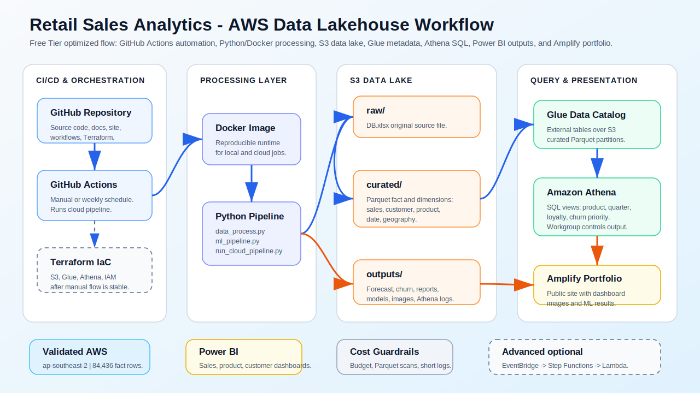
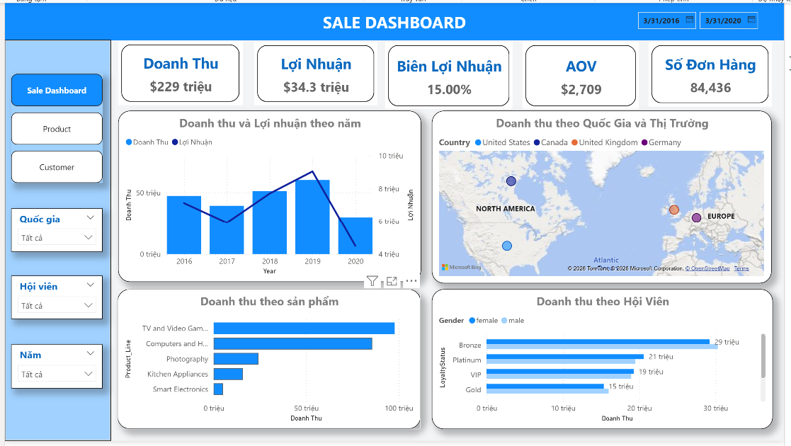
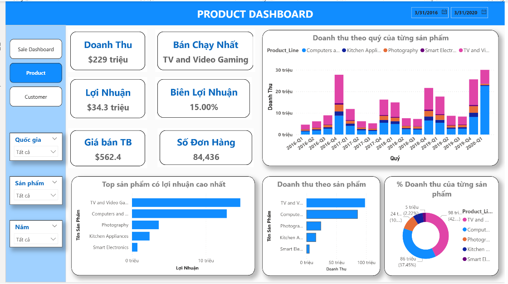
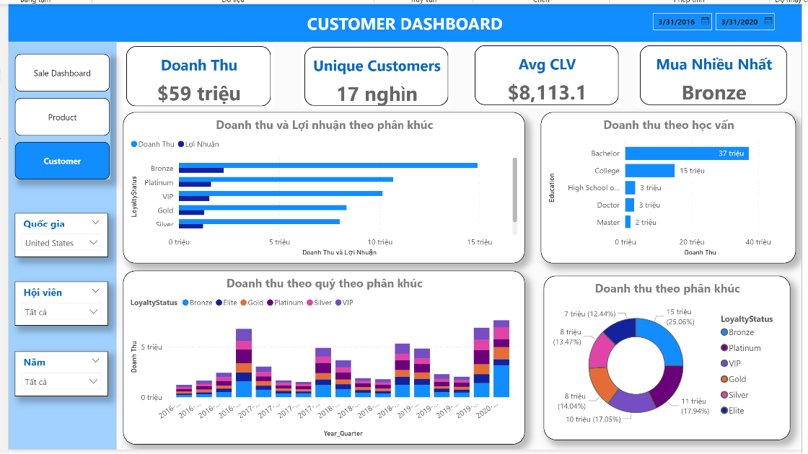
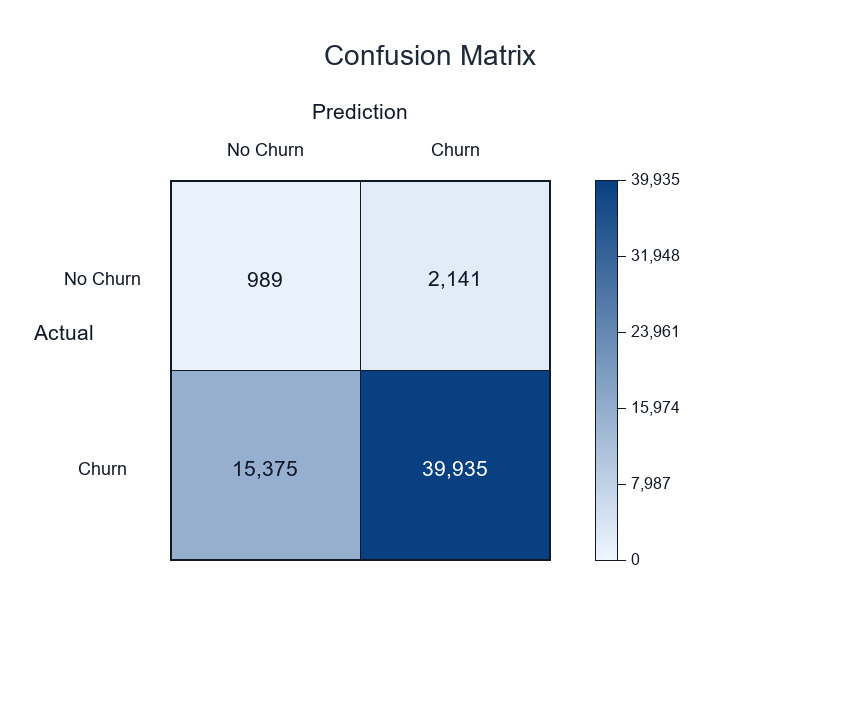

# Báo Cáo Project: Customer Loyalty, Sales Dashboard, Revenue & Profit Forecasting, Churn Prediction

## 1. Tổng Quan Dự Án

Dự án này xây dựng một hệ thống phân tích dữ liệu end-to-end cho bài toán kinh doanh bán lẻ, tập trung vào ba nhóm mục tiêu chính:

- Phân tích hiệu quả kinh doanh qua doanh thu, lợi nhuận, biên lợi nhuận, đơn hàng và giá trị đơn hàng trung bình.
- Xây dựng dashboard Power BI để theo dõi hiệu suất theo thời gian, sản phẩm, quốc gia và phân khúc khách hàng.
- Xây dựng pipeline machine learning để dự báo doanh thu, dự báo lợi nhuận và dự đoán rủi ro churn của khách hàng.

Toàn bộ project đi từ dữ liệu thô trong `DB.xlsx`, qua bước xử lý dữ liệu bằng Python, tạo data model cho Power BI, xây dựng dashboard, huấn luyện mô hình và xuất các báo cáo kết quả.

## 1.1 AWS Cloud Data Lakehouse Module

Project đã được mở rộng từ pipeline chạy local thành một AWS Data Lakehouse nhỏ gọn, tối ưu cho portfolio và AWS Free Tier.

Public portfolio site:

https://main.dkb6koqkmw7iv.amplifyapp.com

Kiến trúc cloud hiện tại:



Cloud module trong repo:

| Component | Vai trò |
|---|---|
| `src/config.py` | Đọc `.env` hoặc environment variables để chuyển Local/S3 mode. |
| `src/utils/io_utils.py` | Helper đọc Excel local/S3 và ghi CSV, Excel, Parquet, binary artifacts. |
| `scripts/run_cloud_pipeline.py` | Chạy full cloud pipeline end-to-end. |
| `scripts/register_glue_tables.py` | Đăng ký Glue external tables từ curated Parquet. |
| `scripts/repair_athena_tables.py` | Chạy `MSCK REPAIR TABLE` để refresh partitions. |
| `scripts/create_athena_views.py` | Tạo Athena demo views. |
| `scripts/validate_athena.py` | Validate row count và query mẫu trên Athena. |
| `.github/workflows/pipeline.yml` | GitHub Actions workflow chạy cloud pipeline manual/weekly. |
| `infra/terraform/` | Terraform scaffold cho S3, Glue, Athena, IAM. |

Kết quả đã validate trên AWS region `ap-southeast-2`:

| Athena table | Row count |
|---|---:|
| `fact_sales` | 84,436 |
| `dim_customer` | 63,228 |
| `dim_product` | 5 |
| `dim_date` | 17 |
| `dim_geography` | 221 |

Athena views đã tạo:

- `sales_by_product`
- `sales_by_quarter`
- `sales_by_loyalty`
- `churn_priority_customers`

Data lake layout:

```text
s3://ver2-retail-analytics/
  raw/
    DB.xlsx
  curated/
    fact_sales/partition_year=YYYY/*.parquet
    dim_customer/partition_loyalty_status=.../*.parquet
    dim_product/*.parquet
    dim_date/partition_year=YYYY/*.parquet
    dim_geography/partition_country=.../*.parquet
  outputs/
    forecast and churn CSVs
    reports/*.xlsx
    models/*.pkl
    images/confusion_matrix.png
    athena/
```

Cloud run:

```powershell
.\aws.cmd sts get-caller-identity
.\aws.cmd s3 ls s3://ver2-retail-analytics/raw/

.\.venv\Scripts\Activate.ps1
pip install -r requirements.txt
$env:PYTHONIOENCODING="utf-8"
python scripts/run_cloud_pipeline.py
```

GitHub Actions cần cấu hình repository secrets:

```text
AWS_ACCESS_KEY_ID
AWS_SECRET_ACCESS_KEY
```

## 2. Cấu Trúc File

| File/Folder | Nội dung |
|---|---|
| `DB.xlsx` | Dữ liệu gốc. Sheet chính: `FILE_DATA_HANDONLAB2`. |
| `data_process.py` | Script xử lý dữ liệu, tạo feature và xuất data model. |
| `data_model.xlsx` | Data model đã xử lý, dùng cho Power BI và ML pipeline. |
| `report_dashboard.pbix` | File dashboard Power BI. |
| `ml_pipeline.py` | Entrypoint chính để chạy pipeline ML mới. |
| `run_modular_ml_pipeline.py` | Runner của pipeline ML dạng module. |
| `src/` | Source code module hóa cho ML pipeline. |
| `outputs/` | Toàn bộ output của pipeline ML: forecast, metrics, report, model. |
| `docs/images/` | Ảnh dashboard và confusion matrix dùng trong README. |
| `requirements.txt` | Danh sách thư viện Python cần thiết. |

## 3. Dữ Liệu Và Phạm Vi Phân Tích

Dữ liệu gồm thông tin giao dịch, khách hàng, sản phẩm, địa lý, coupon và thời gian đặt hàng.

Các nhóm biến chính:

- Khách hàng: `Customer_ID`, tên khách hàng, giới tính, học vấn, thu nhập, tình trạng hôn nhân.
- Loyalty: `LoyaltyStatus`, `Months_As_Member`, `CLV`.
- Sản phẩm: `Product_Line`, `Unit_Sale_Price`, `Unit_Cost`, `Quantity_Sold`.
- Giao dịch: `Revenue`, `Order_Count`, `Coupon_Response`.
- Thời gian: `Year`, `Quarter`, `Year_Quarter`.
- Địa lý: quốc gia, tỉnh/bang, thành phố, latitude, longitude.

Lưu ý về thời gian: dữ liệu gốc chỉ có `Year` và `Quarter`, không có ngày hoặc tháng giao dịch thật. Vì vậy phần time series forecasting được thực hiện ở cấp **quý**, đúng với độ chi tiết thực tế của dữ liệu.

Thống kê tổng quan:

| Chỉ số | Giá trị |
|---|---:|
| Số dòng giao dịch | 84,436 |
| Số khách hàng duy nhất | 63,228 |
| Khoảng thời gian | 2016-Q1 đến 2020-Q1 |
| Tổng doanh thu | $228.74M |
| Tổng lợi nhuận | $34.30M |
| Biên lợi nhuận | 15.00% |
| Tổng số đơn hàng | 84,436 |
| AOV | $2,709.05 |
| Avg CLV | $8,113.13 |

## 4. Quy Trình Xử Lý Dữ Liệu

Script `data_process.py` thực hiện các bước:

1. Đọc dữ liệu từ `DB.xlsx`.
2. Chuẩn hóa tên cột và loại bỏ khoảng trắng thừa.
3. Tạo các biến kinh doanh:
   - `Profit`
   - `Profit_Margin_Pct`
   - `ATV`
   - `Revenue_Per_Unit`
   - `Total_Cost`
   - `Gross_Contribution`
4. Tạo biến thời gian:
   - `Year_Quarter`
   - `Quarter_Num`
   - `Date_Key`
5. Tạo biến phân khúc:
   - `Loyalty_Rank`
   - `Education_Rank`
   - `Income_Bucket`
   - `Tenure_Bucket`
   - `CLV_Segment`
6. Xuất data model sang `data_model.xlsx`.

## 5. Data Model

File `data_model.xlsx` được tổ chức theo hướng star schema để phục vụ Power BI:

| Bảng | Số dòng | Vai trò |
|---|---:|---|
| `FACT_Sales` | 84,436 | Bảng fact giao dịch chính. |
| `DIM_Customer` | 63,228 | Thông tin khách hàng. |
| `DIM_Product` | 5 | Danh mục sản phẩm. |
| `DIM_Geography` | 221 | Thông tin địa lý. |
| `DIM_Date` | 17 | Dimension thời gian theo quý. |
| `AGG_KPI` | 11 | Bảng KPI tổng hợp. |
| `AGG_Year_Product` | 25 | Tổng hợp theo năm và sản phẩm. |
| `AGG_Country_Year` | 20 | Tổng hợp theo quốc gia và năm. |
| `AGG_Loyalty` | 6 | Tổng hợp theo loyalty segment. |
| `AGG_Edu_Product` | 25 | Tổng hợp theo học vấn và sản phẩm. |
| `AGG_Gender_Product` | 10 | Tổng hợp theo giới tính và sản phẩm. |
| `AGG_Coupon` | 6 | Tổng hợp hiệu quả coupon. |

Quan hệ chính trong Power BI:

- `DIM_Date[Date_Key]` nối với `FACT_Sales[Date_Key]`
- `DIM_Customer[Customer_ID]` nối với `FACT_Sales[Customer_ID]`
- `DIM_Product[Product_ID]` nối với `FACT_Sales[Product_ID]`
- `DIM_Geography[Geo_Key]` nối với `FACT_Sales[Geo_Key]`

## 6. Dashboard Power BI

Dashboard được xây dựng trong `report_dashboard.pbix`, gồm ba trang chính.

### 6.1 Sales Dashboard



Sales Dashboard cung cấp góc nhìn tổng quan về tình hình kinh doanh:

- Doanh thu: $229M
- Lợi nhuận: $34.3M
- Biên lợi nhuận: 15.00%
- AOV: $2,709
- Số đơn hàng: 84,436

Các biểu đồ chính:

- Doanh thu và lợi nhuận theo năm.
- Doanh thu theo quốc gia và thị trường.
- Doanh thu theo sản phẩm.
- Doanh thu theo hội viên.

### 6.2 Product Dashboard



Product Dashboard phân tích hiệu quả từng nhóm sản phẩm:

- Tổng doanh thu.
- Lợi nhuận.
- Biên lợi nhuận.
- Giá bán trung bình.
- Sản phẩm bán chạy nhất.
- Tỷ trọng doanh thu theo sản phẩm.
- Doanh thu theo quý của từng product line.

### 6.3 Customer Dashboard



Customer Dashboard tập trung vào hành vi và giá trị khách hàng:

- Doanh thu theo loyalty segment.
- Doanh thu và lợi nhuận theo phân khúc khách hàng.
- Doanh thu theo học vấn.
- Doanh thu theo quý của từng loyalty segment.
- Tỷ trọng doanh thu theo phân khúc.
- Avg CLV và unique customers.

## 7. Kết Quả Phân Tích Kinh Doanh

### 7.1 Hiệu Suất Theo Sản Phẩm

| Product Line | Doanh thu | Lợi nhuận |
|---|---:|---:|
| TV and Video Gaming | $97.85M | $14.67M |
| Computers and Home Office | $85.66M | $12.85M |
| Photography | $24.26M | $3.64M |
| Kitchen Appliances | $15.89M | $2.38M |
| Smart Electronics | $5.08M | $0.76M |

Hai nhóm `TV and Video Gaming` và `Computers and Home Office` đóng góp phần lớn doanh thu toàn bộ danh mục sản phẩm.

### 7.2 Hiệu Suất Theo Loyalty Segment

| LoyaltyStatus | Doanh thu | Lợi nhuận | Số khách hàng |
|---|---:|---:|---:|
| Bronze | $60.10M | $9.01M | 11,079 |
| Platinum | $40.45M | $6.07M | 11,127 |
| VIP | $38.38M | $5.75M | 10,449 |
| Gold | $30.95M | $4.64M | 10,996 |
| Silver | $30.81M | $4.62M | 10,804 |
| Elite | $28.06M | $4.21M | 10,688 |

Nhóm Bronze tạo ra doanh thu lớn nhất. Điều này cho thấy tổng giá trị segment không chỉ phụ thuộc vào cấp loyalty, mà còn phụ thuộc vào số lượng khách hàng và hành vi mua hàng trong từng nhóm.

### 7.3 Doanh Thu Giai Đoạn Gần Nhất

| Quý | Doanh thu | Lợi nhuận |
|---|---:|---:|
| 2018-Q4 | $21.62M | $3.24M |
| 2019-Q1 | $17.62M | $2.64M |
| 2019-Q2 | $8.73M | $1.31M |
| 2019-Q3 | $8.34M | $1.25M |
| 2019-Q4 | $25.62M | $3.84M |
| 2020-Q1 | $30.02M | $4.50M |

Doanh thu có tính mùa vụ rõ, đặc biệt các quý Q4 thường có mức tăng mạnh. `2020-Q1` là quý có doanh thu cao nhất trong dữ liệu hiện có.

## 8. Machine Learning Pipeline

Pipeline ML mới được module hóa trong thư mục `src/` và chạy qua:

```bash
python ml_pipeline.py
```

Pipeline gồm bốn bước:

1. Load dữ liệu từ `data_model.xlsx`.
2. Validate schema và chất lượng dữ liệu.
3. Train và backtest mô hình forecast doanh thu/lợi nhuận.
4. Train và evaluate mô hình churn prediction.

Các output chính:

| Output | Nội dung |
|---|---|
| `outputs/data_validation_report.csv` | Báo cáo kiểm tra dữ liệu. |
| `outputs/forecast_revenue_profit.csv` | Kết quả dự báo doanh thu và lợi nhuận. |
| `outputs/forecast_model_comparison.csv` | Bảng so sánh mô hình forecast. |
| `outputs/forecast_backtest.csv` | Backtest rolling-origin. |
| `outputs/forecast_selected_model_backtest.csv` | Kết quả che dữ liệu của model được chọn, gồm Actual, Predicted, Error, MAE, RMSE, MAPE, sMAPE và Bias. |
| `outputs/time_series_stationarity.csv` | Kiểm định tính dừng ADF cho level, log, sai phân và seasonal differencing. |
| `outputs/time_series_seasonality.csv` | Seasonal index theo quý cho doanh thu và lợi nhuận. |
| `outputs/churn_model_metrics.csv` | Chỉ số train/validation churn model. |
| `outputs/churn_model_comparison.csv` | So sánh thuật toán churn bằng rolling backtest theo snapshot. |
| `outputs/churn_backtest.csv` | Chi tiết kết quả che dữ liệu cho từng snapshot và từng thuật toán churn. |
| `outputs/churn_confusion_matrix.csv` | Confusion matrix của churn model. |
| `outputs/churn_predictions_snapshot_2020Q1.csv` | Dự báo churn theo khách hàng tại snapshot 2020-Q1. |
| `outputs/churn_feature_importance.csv` | Feature importance của churn model. |
| `outputs/reports/churn_customer_action_list.xlsx` | File Excel danh sách khách hàng ưu tiên cho CSKH/CRM, gồm risk segment, xác suất churn, giá trị rủi ro và hành động khuyến nghị. |
| `outputs/reports/modular_ml_report.xlsx` | Báo cáo Excel tổng hợp. |

## 9. Dự Báo Doanh Thu Và Lợi Nhuận Theo Time Series

### 9.1 Quy Trình Time Series

Nhánh forecast được thiết kế theo quy trình của một bài toán time series:

1. Tổng hợp dữ liệu theo quý.
2. Phân tích mùa vụ theo `Quarter_Num`.
3. Kiểm định tính dừng bằng Augmented Dickey-Fuller test.
4. Kiểm tra các biến đổi:
   - Chuỗi gốc.
   - Log transform.
   - Sai phân bậc 1.
   - Sai phân mùa vụ chu kỳ 4 quý.
   - Sai phân bậc 1 kết hợp sai phân mùa vụ.
5. Tune nhiều cấu hình SARIMA.
6. So sánh với baseline theo mùa vụ.
7. Chọn model theo rolling-origin backtest.
8. Forecast doanh thu và lợi nhuận theo quý cho `2020-Q2` đến `2021-Q4`.

Mục tiêu dự báo:

- `Revenue`
- `Profit`

Feature chính:

- Seasonal structure theo chu kỳ 4 quý.
- Sai phân thường `d`.
- Sai phân mùa vụ `D`.
- Thành phần AR/MA không mùa vụ `(p, q)`.
- Thành phần AR/MA mùa vụ `(P, Q)`.

Các mô hình được so sánh:

- `SeasonalNaive`
- `SeasonalGrowth`
- SARIMA với nhiều cấu hình, ví dụ:
  - `(0,1,0)x(0,1,0,4)`
  - `(1,1,0)x(0,1,0,4)`
  - `(0,1,1)x(0,1,0,4)`
  - `(1,1,1)x(0,1,0,4)`
  - `(1,1,0)x(1,1,0,4)`
  - `(0,1,1)x(0,1,1,4)`
  - `(1,1,1)x(1,1,0,4)`
  - `(1,1,1)x(0,1,1,4)`

### 9.2 Mô Tả Thuật Toán SeasonalNaive Và SeasonalGrowth

#### SeasonalNaive

`SeasonalNaive` là mô hình baseline mùa vụ đơn giản. Mô hình giả định rằng giá trị của một quý trong tương lai sẽ gần giống với giá trị của cùng quý ở chu kỳ mùa vụ trước đó.

Với dữ liệu theo quý, chu kỳ mùa vụ là `s = 4`. Công thức dự báo:

```text
Forecast(t) = Actual(t - 4)
```

Ví dụ:

```text
Forecast 2020-Q4 = Actual 2019-Q4
Forecast 2021-Q1 = Actual 2020-Q1
```

Cách hoạt động:

1. Sắp xếp chuỗi thời gian theo quý.
2. Xác định chu kỳ mùa vụ là 4 quý.
3. Khi dự báo quý tiếp theo, lấy giá trị của cùng quý năm trước làm dự báo.

Ưu điểm:

- Dễ hiểu, dễ giải thích với business.
- Là baseline bắt buộc trong bài toán seasonal forecasting.
- Hoạt động tốt nếu dữ liệu có mùa vụ ổn định và không có trend lớn.

Hạn chế:

- Không học được xu hướng tăng/giảm qua thời gian.
- Không điều chỉnh nếu doanh thu năm sau tăng trưởng cao hơn năm trước.
- Dễ under-forecast khi business đang tăng trưởng.

#### SeasonalGrowth

`SeasonalGrowth` là phiên bản mở rộng của `SeasonalNaive`. Thay vì chỉ lấy cùng quý năm trước, mô hình nhân giá trị cùng quý năm trước với hệ số tăng trưởng YoY trung vị trong lịch sử.

Công thức:

```text
Forecast(t) = Actual(t - 4) * Median_YoY_Growth
```

Trong đó:

```text
YoY_Growth(t) = Actual(t) / Actual(t - 4)
Median_YoY_Growth = median của các YoY_Growth hợp lệ trong lịch sử
```

Ví dụ:

```text
Forecast 2020-Q4 = Actual 2019-Q4 * Median_YoY_Growth
Forecast 2021-Q1 = Forecast/Actual 2020-Q1 * Median_YoY_Growth
```

Cách hoạt động:

1. Tính tăng trưởng YoY cho từng quý có dữ liệu cùng quý năm trước.
2. Lấy median của các tỷ lệ tăng trưởng YoY để giảm ảnh hưởng của outlier.
3. Dự báo quý tương lai bằng cùng quý năm trước nhân với hệ số tăng trưởng trung vị.
4. Với forecast nhiều bước, mô hình cập nhật rolling history bằng chính giá trị đã dự báo.

Ưu điểm:

- Giữ được cấu trúc mùa vụ theo quý.
- Có thêm yếu tố tăng trưởng so với `SeasonalNaive`.
- Ít overfit, phù hợp khi số điểm dữ liệu lịch sử ít.
- Median growth ổn định hơn mean growth khi dữ liệu có quý bất thường.

Hạn chế:

- Không mô hình hóa đầy đủ autocorrelation như ARIMA/SARIMA.
- Không bắt được shock bất thường nếu lịch sử chưa từng có pattern tương tự.
- Phụ thuộc mạnh vào giả định rằng tăng trưởng YoY trong tương lai tương tự trung vị lịch sử.

Trong project này, `SeasonalGrowth` được chọn vì dữ liệu chỉ có 17 quý, trong khi SARIMA cần nhiều điểm dữ liệu hơn để ước lượng ổn định. Backtest cho thấy `SeasonalGrowth` có sai số thấp hơn các cấu hình SARIMA được thử nghiệm.

### 9.3 Kiểm Định Tính Dừng

Kết quả ADF cho thấy chuỗi gốc chưa dừng, còn sai phân bậc 1 và kết hợp sai phân bậc 1 với sai phân mùa vụ đạt tính dừng ở mức ý nghĩa 5%.

| Target | Transform | ADF p-value | Stationary at 5% |
|---|---|---:|---|
| Revenue | level | 0.9890 | False |
| Revenue | log_level | 0.9907 | False |
| Revenue | diff_1 | 0.0000 | True |
| Revenue | seasonal_diff_4 | 0.3077 | False |
| Revenue | diff_1_and_seasonal_diff_4 | 0.0000 | True |
| Profit | level | 0.9890 | False |
| Profit | log_level | 0.9907 | False |
| Profit | diff_1 | 0.0000 | True |
| Profit | seasonal_diff_4 | 0.3078 | False |
| Profit | diff_1_and_seasonal_diff_4 | 0.0000 | True |

### 9.4 Phân Tích Mùa Vụ

Seasonal index cho thấy Q4 và Q1 là hai quý cao điểm. Q2 và Q3 thấp hơn đáng kể so với trung bình.

| Target | Quarter | Seasonal Index |
|---|---:|---:|
| Revenue | Q1 | 1.175 |
| Revenue | Q2 | 0.533 |
| Revenue | Q3 | 0.552 |
| Revenue | Q4 | 1.697 |
| Profit | Q1 | 1.175 |
| Profit | Q2 | 0.533 |
| Profit | Q3 | 0.552 |
| Profit | Q4 | 1.697 |

### 9.5 Kết Quả So Sánh Mô Hình Forecast

Model được chọn theo rolling-origin backtest. Mặc dù SARIMA đã được tune, `SeasonalGrowth` vẫn là champion model vì dữ liệu chỉ có 17 quý và seasonal-growth baseline cho sai số thấp hơn các cấu hình SARIMA.

| Target | Model | Order | Seasonal Order | MAE | RMSE | MAPE | sMAPE | Bias |
|---|---|---|---|---:|---:|---:|---:|---:|
| Revenue | SeasonalGrowth | - | - | $2.20M | $4.13M | 9.24% | 10.26% | -$1.50M |
| Revenue | SARIMA | `(1,1,1)` | `(0,1,0,4)` | $3.23M | $5.00M | 13.01% | 14.81% | -$3.23M |
| Revenue | SARIMA | `(0,1,0)` | `(0,1,0,4)` | $3.11M | $4.21M | 14.57% | 15.11% | -$1.41M |
| Revenue | SeasonalNaive | - | - | $6.39M | $8.80M | 30.58% | 38.74% | -$6.39M |
| Profit | SeasonalGrowth | - | - | $0.33M | $0.62M | 9.23% | 10.25% | -$0.22M |
| Profit | SARIMA | `(1,1,1)` | `(0,1,0,4)` | $0.48M | $0.75M | 13.01% | 14.82% | -$0.48M |
| Profit | SARIMA | `(0,1,0)` | `(0,1,0,4)` | $0.47M | $0.63M | 14.57% | 15.11% | -$0.21M |
| Profit | SeasonalNaive | - | - | $0.96M | $1.32M | 30.58% | 38.75% | -$0.96M |

Kết luận forecast: dữ liệu có seasonality rất mạnh, nhưng số điểm lịch sử còn ít. Vì vậy baseline có kiểm soát mùa vụ và tăng trưởng YoY đang ổn định hơn SARIMA trong backtest. Dự án không forecast theo tháng vì dữ liệu không có timestamp ở cấp tháng.

### 9.6 Kết Quả Che Dữ Liệu Của Model Được Chọn

Chiến lược đánh giá là rolling-origin backtest. Ở mỗi lần đánh giá, pipeline chỉ dùng dữ liệu đến quý liền trước để dự đoán quý kế tiếp. Các quý được che gồm `2019-Q1` đến `2020-Q1`.

Kết quả backtest cho `Revenue` với model được chọn `SeasonalGrowth`:

| Quý che | Actual Revenue | Predicted Revenue | Error | MAE/RMSE | MAPE | sMAPE |
|---|---:|---:|---:|---:|---:|---:|
| 2019-Q1 | $17.62M | $18.48M | $0.85M | $0.85M | 4.84% | 4.72% |
| 2019-Q2 | $8.73M | $9.27M | $0.54M | $0.54M | 6.13% | 5.95% |
| 2019-Q3 | $8.34M | $8.71M | $0.37M | $0.37M | 4.38% | 4.28% |
| 2019-Q4 | $25.62M | $25.55M | -$0.08M | $0.08M | 0.30% | 0.30% |
| 2020-Q1 | $30.02M | $20.86M | -$9.17M | $9.17M | 30.54% | 36.04% |

Kết quả backtest cho `Profit` với model được chọn `SeasonalGrowth`:

| Quý che | Actual Profit | Predicted Profit | Error | MAE/RMSE | MAPE | sMAPE |
|---|---:|---:|---:|---:|---:|---:|
| 2019-Q1 | $2.64M | $2.77M | $0.13M | $0.13M | 4.82% | 4.70% |
| 2019-Q2 | $1.31M | $1.39M | $0.08M | $0.08M | 6.12% | 5.94% |
| 2019-Q3 | $1.25M | $1.31M | $0.05M | $0.05M | 4.37% | 4.28% |
| 2019-Q4 | $3.84M | $3.83M | -$0.01M | $0.01M | 0.29% | 0.29% |
| 2020-Q1 | $4.50M | $3.13M | -$1.37M | $1.37M | 30.53% | 36.03% |

Nhìn vào bảng che dữ liệu, model dự báo khá tốt trong bốn quý của năm 2019, nhưng bị under-forecast ở `2020-Q1`. Điều này cho thấy `2020-Q1` là quý tăng trưởng bất thường so với pattern lịch sử, làm sai số holdout tăng mạnh.

### 9.7 Kết Quả Dự Báo

| Quý | Predicted Revenue | Revenue CI Lower | Revenue CI Upper | Predicted Profit | Profit CI Lower | Profit CI Upper |
|---|---:|---:|---:|---:|---:|---:|
| 2020-Q2 | $10.35M | $9.39M | $11.30M | $1.55M | $1.41M | $1.70M |
| 2020-Q3 | $9.89M | $8.98M | $10.80M | $1.48M | $1.35M | $1.62M |
| 2020-Q4 | $30.37M | $27.56M | $33.17M | $4.55M | $4.13M | $4.97M |
| 2021-Q1 | $35.58M | $32.30M | $38.87M | $5.34M | $4.84M | $5.83M |
| 2021-Q2 | $12.26M | $11.13M | $13.40M | $1.84M | $1.67M | $2.01M |
| 2021-Q3 | $11.72M | $10.64M | $12.80M | $1.76M | $1.60M | $1.92M |
| 2021-Q4 | $35.99M | $32.67M | $39.32M | $5.40M | $4.90M | $5.90M |

Dự báo cho thấy doanh thu và lợi nhuận tiếp tục có pattern mùa vụ mạnh, với Q4 và Q1 là các giai đoạn cao điểm.

## 10. Churn Prediction

### 10.1 Thiết Lập Bài Toán

Mục tiêu của churn model là dự đoán xác suất khách hàng không mua trong 2 quý tiếp theo.

Target:

```text
Y_Churn_Next_2Q = 1 nếu khách hàng không phát sinh giao dịch trong 2 quý tiếp theo
```

Các thuật toán được so sánh bằng rolling backtest theo snapshot:

```text
Logistic_Balanced
Logistic_StrongL2
Logistic_Unweighted
XGBoost_Balanced
XGBoost_Regularized
```

Champion model được chọn là `XGBoost_Regularized`. Model được chọn theo `macro_f1` và `balanced_accuracy`, đồng thời phải đạt điều kiện tối thiểu về cả recall của lớp churn và specificity của lớp không churn. Cách chọn này tránh trường hợp model chỉ dự đoán gần như toàn bộ khách hàng là churn.

Feature chính:

- `Recency`
- `Tenure`
- `Active_Quarters`
- `Active_Rate`
- `Avg_Gap`
- `Total_Orders`
- `Total_Revenue`
- `Total_Profit`
- `Freq_L1Q`, `Freq_L2Q`, `Freq_L4Q`
- `Rev_L1Q`, `Rev_L2Q`, `Rev_L4Q`
- `Revenue_Trend_2Q`
- `Coupon_Diversity`
- `Loyalty_Rank`
- `CLV`
- `Income_Imputed`
- `Education_Rank`
- `Gender_Male`

### 10.2 Kết Quả Train Và Validation

| Chỉ số | Giá trị |
|---|---:|
| Model | XGBoost_Regularized |
| Train rows | 279,542 |
| Validation rows | 58,440 |
| Train churn rate | 98.93% |
| Validation churn rate | 94.64% |
| Operating threshold | 0.4631 |
| Accuracy | 70.09% |
| Precision | 94.93% |
| Recall churn | 72.26% |
| Specificity no churn | 31.76% |
| F1-score churn | 82.06% |
| F1-score no churn | 10.21% |
| Macro F1 | 46.14% |
| Balanced accuracy | 52.01% |
| ROC-AUC | 52.01% |
| Lift@Top10% | 1.00 |
| Brier score | 0.2203 |

### 10.3 Kết Quả So Sánh Thuật Toán Churn

Pipeline che dữ liệu theo từng snapshot lịch sử, train trên các snapshot trước đó và validate trên snapshot bị che. Các snapshot validation chính là `12`, `13`, `14`, `15`, tương ứng với nhiều mốc lịch sử trước snapshot scoring cuối cùng.

| Model | Eligible Champion | Backtests | Macro F1 | Balanced Accuracy | Recall Churn | Specificity No Churn |
|---|---|---:|---:|---:|---:|---:|
| XGBoost_Regularized | True | 4 | 44.99% | 62.03% | 73.28% | 50.79% |
| XGBoost_Balanced | True | 4 | 44.74% | 62.28% | 72.53% | 52.02% |
| Logistic_Unweighted | False | 4 | 50.36% | 50.45% | 99.41% | 1.49% |
| Logistic_Balanced | False | 4 | 39.15% | 58.39% | 58.25% | 58.52% |
| Logistic_StrongL2 | False | 4 | 38.65% | 58.29% | 57.08% | 59.50% |

`Logistic_Unweighted` có macro F1 nhìn bề ngoài cao nhưng bị loại khỏi champion vì specificity chỉ khoảng 1.49%, tức gần như gắn nhãn churn cho toàn bộ khách hàng. Với mục tiêu vận hành cho CSKH, model như vậy không phù hợp vì tạo quá nhiều false positive.

### 10.4 Confusion Matrix



Confusion matrix trên validation set:

| Actual / Prediction | Predicted No Churn | Predicted Churn |
|---|---:|---:|
| Actual No Churn | 994 | 2,136 |
| Actual Churn | 15,342 | 39,968 |

Diễn giải:

- Mô hình nhận diện đúng 39,968 khách hàng churn trong validation set.
- Mô hình nhận diện đúng 994 khách hàng không churn.
- False positive còn cao vì dữ liệu cực lệch lớp: validation churn rate đạt 94.64%.
- ROC-AUC chỉ khoảng 52.01%, cho thấy bài toán churn trong dataset này khó phân tách nếu chỉ dựa trên lịch sử giao dịch theo quý. Vì vậy, output nên dùng như danh sách ưu tiên hành động, không nên hiểu là quyết định tuyệt đối.

### 10.5 Output Hành Động Cho CSKH/CRM

Pipeline xuất thêm file:

```text
outputs/reports/churn_customer_action_list.xlsx
```

File này được thiết kế để chuyển cho đội CSKH/CRM ra quyết định. Các sheet chính:

| Sheet | Nội dung |
|---|---|
| `All_Customers` | Toàn bộ khách hàng được scoring tại snapshot `2020-Q1`. |
| `CSKH_Priority_List` | Nhóm `Critical` và `High Risk`, ưu tiên liên hệ trước. |
| `Selected_Model_Metrics` | Chỉ số model champion. |
| `Model_Comparison` | So sánh thuật toán bằng rolling backtest. |
| `Backtest_Detail` | Chi tiết từng fold che dữ liệu. |

Các cột hỗ trợ ra quyết định gồm:

- `Churn_Probability_Next_2Q`: xác suất khách hàng không mua trong 2 quý tới.
- `Predicted_Churn`: nhãn dự báo theo threshold vận hành.
- `Churn_Risk_Segment`: `Critical`, `High Risk`, `Medium Risk`, `Low Risk`, `Healthy`.
- `Expected_Revenue_At_Risk`: doanh thu lịch sử có rủi ro mất đi, có trọng số theo xác suất churn.
- `Retention_Priority_Score`: điểm ưu tiên giữ chân, kết hợp xác suất churn và CLV.
- `Action_Owner`: bộ phận phụ trách hành động.
- `Recommended_Action`: hành động khuyến nghị.
- `Action_Reason`: lý do chính để CSKH hiểu vì sao khách hàng được ưu tiên.

Phân bổ risk segment tại snapshot scoring `2020-Q1`:

| Segment | Số khách hàng |
|---|---:|
| Critical | 13,719 |
| High Risk | 31,643 |
| Medium Risk | 14,133 |
| Low Risk | 2,631 |
| Healthy | 1,102 |

### 10.6 Feature Importance

Top feature theo gain importance của `XGBoost_Regularized` được lưu tại:

```text
outputs/churn_feature_importance.csv
```

Feature importance được dùng để giải thích tương đối những tín hiệu model sử dụng khi scoring. Do dữ liệu chỉ có độ chi tiết theo quý và churn rate rất lệch lớp, phần giải thích nên được dùng như định hướng phân tích, không thay thế việc kiểm chứng bằng chiến dịch giữ chân thực tế.

## 11. Data Validation

Trước khi train, pipeline kiểm tra các điều kiện dữ liệu quan trọng:

- Schema của `FACT_Sales`.
- Schema của `DIM_Customer`.
- Số dòng fact và dimension.
- Số customer duy nhất.
- Null cells.
- Duplicate customer id.
- Negative revenue/profit.
- Orphan customer keys.

Báo cáo validation được lưu tại:

```text
outputs/data_validation_report.csv
```

## 12. Cách Chạy Project

Cài đặt thư viện:

```bash
pip install -r requirements.txt
```

Chạy xử lý dữ liệu:

```bash
python data_process.py
```

Chạy pipeline ML:

```bash
python ml_pipeline.py
```

Chạy smoke test:

```bash
python -m unittest discover -s tests
```

## 13. Kết Luận

Project đã hoàn thiện một quy trình phân tích dữ liệu end-to-end:

- Dữ liệu thô được làm sạch và chuẩn hóa.
- Data model được tổ chức theo star schema phục vụ Power BI.
- Dashboard thể hiện được góc nhìn tổng quan về sales, product và customer.
- Pipeline ML dự báo được doanh thu và lợi nhuận theo quý.
- Churn model xuất được probability, segment, metrics, confusion matrix và feature importance.
- Toàn bộ kết quả được lưu thành CSV, Excel report và hình ảnh phục vụ báo cáo.

Kết quả phân tích cho thấy doanh thu có tính mùa vụ rõ ràng, đặc biệt ở Q4 và Q1. Hai nhóm sản phẩm đóng góp lớn nhất là `TV and Video Gaming` và `Computers and Home Office`. Nhóm khách hàng Bronze đóng góp doanh thu cao nhất xét theo tổng doanh thu. Mô hình forecast chọn `SeasonalGrowth` cho cả revenue và profit, trong khi churn model cung cấp baseline scoring theo xác suất rời bỏ trong 2 quý tiếp theo.
