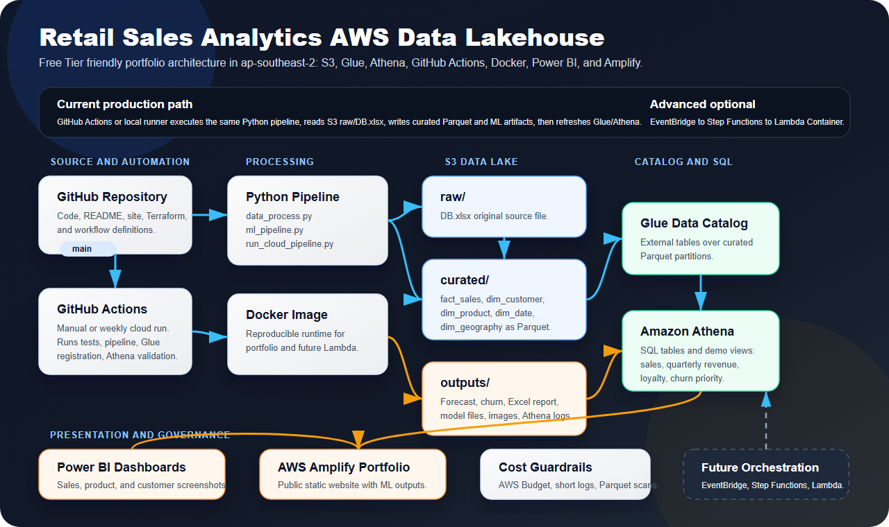
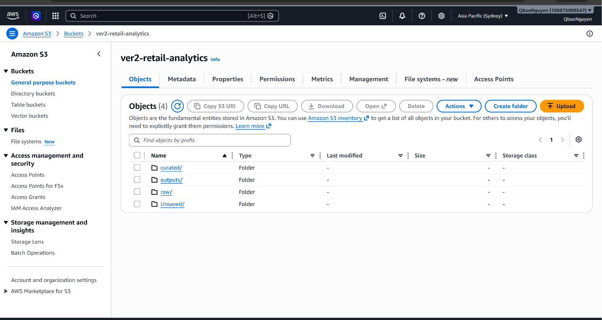
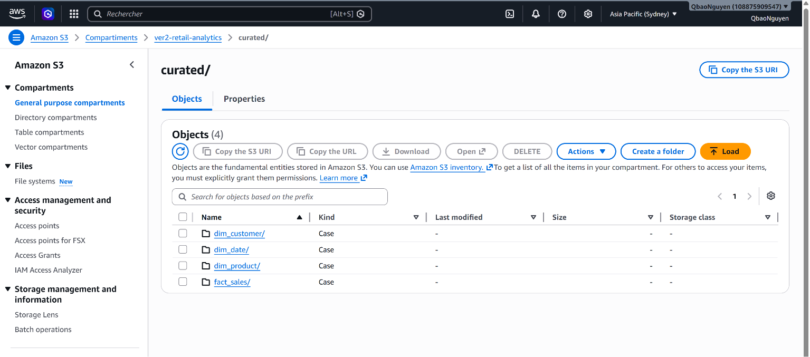
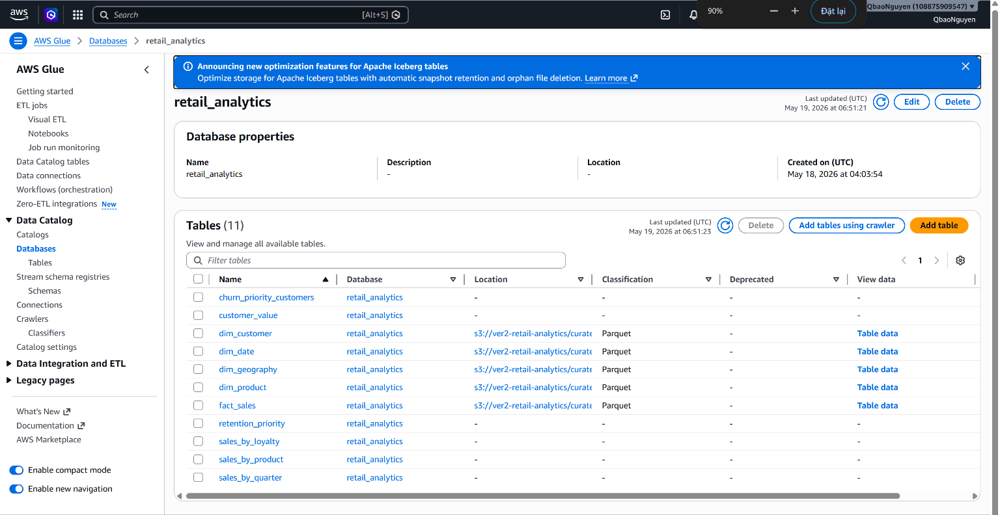
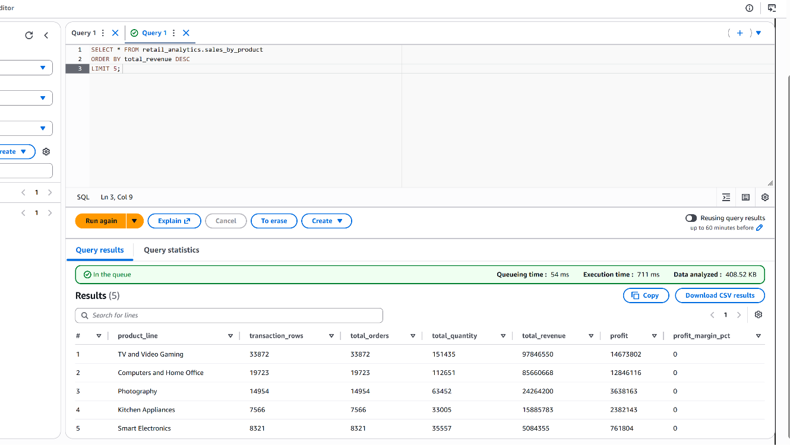
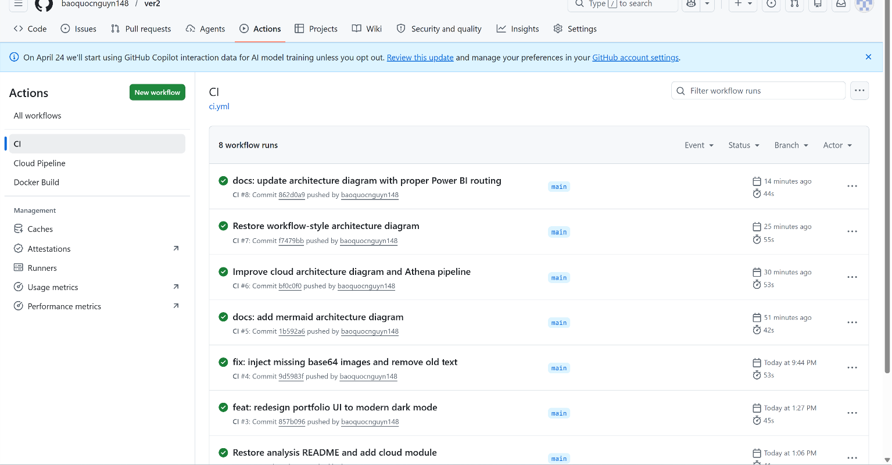
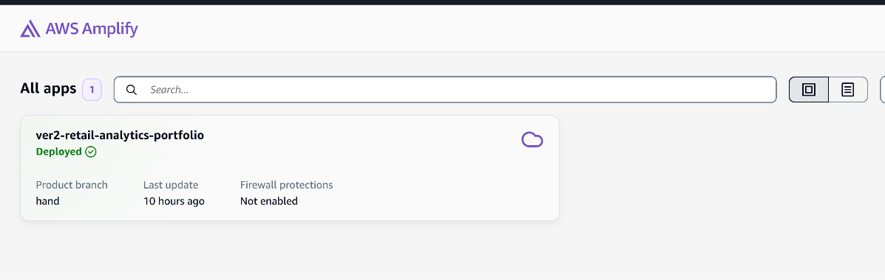
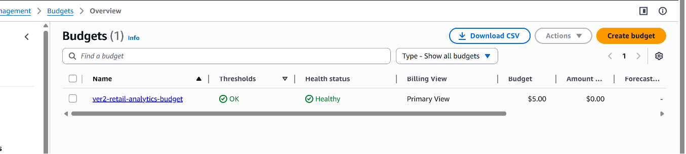

# AWS Deployment Runbook

## Current Architecture



## Environment

Use `ap-southeast-2`; the S3 bucket and Glue database are in this region.

```env
LOCAL_MODE=false
S3_BUCKET=ver2-retail-analytics
RAW_KEY=raw/DB.xlsx
CURATED_PREFIX=curated/
OUTPUT_PREFIX=outputs/
ATHENA_DATABASE=retail_analytics
ATHENA_WORKGROUP=retail_analytics_workgroup
ATHENA_OUTPUT=s3://ver2-retail-analytics/outputs/athena/
AWS_DEFAULT_REGION=ap-southeast-2
WORK_DIR=/tmp/ver2
```

On Windows local runs, `WORK_DIR=C:\tmp\ver2` is also valid.

## Manual Cloud Run

```powershell
.\aws.cmd sts get-caller-identity
.\aws.cmd s3 ls s3://ver2-retail-analytics/raw/

.\.venv\Scripts\Activate.ps1
pip install -r requirements.txt
$env:PYTHONIOENCODING="utf-8"
python scripts/run_cloud_pipeline.py
```

The cloud pipeline runs:

1. `data_process.py`
2. `scripts/run_data_quality.py`
3. `ml_pipeline.py`
4. `scripts/register_glue_tables.py`
5. `scripts/repair_athena_tables.py`
6. `scripts/create_athena_views.py`
7. `scripts/validate_athena.py`

The main pattern is ETL first, with an ELT/query layer after curated Parquet is
written to S3:

```text
Python ETL -> curated Parquet -> Glue external tables -> Athena SQL views
```

## Validated Athena Counts

These counts were validated after writing curated Parquet to S3:

| Table | Rows |
|---|---:|
| `fact_sales` | 84,436 |
| `dim_customer` | 63,228 |
| `dim_product` | 5 |
| `dim_date` | 17 |
| `dim_geography` | 221 |

Demo views:

- `sales_by_product`
- `sales_by_quarter`
- `sales_by_loyalty`
- `customer_value`
- `retention_priority`
- `churn_priority_customers`

## Cloud Evidence

| Evidence | Screenshot |
|---|---|
| S3 data lake root |  |
| S3 curated Parquet layer |  |
| Glue Data Catalog tables |  |
| Athena sales view query |  |
| GitHub Actions CI success |  |
| Amplify public deploy |  |
| AWS Budget guardrail |  |

## GitHub Actions

Required repository secrets:

```text
AWS_ACCESS_KEY_ID
AWS_SECRET_ACCESS_KEY
```

Workflows:

- `CI`: install dependencies and run smoke tests.
- `Cloud Pipeline`: manual or weekly scheduled S3/Glue/Athena pipeline.
- `Docker Build`: verify the container image builds.

## Amplify Portfolio

Connect the GitHub repo to AWS Amplify Hosting and use the included
`amplify.yml`. The site is static and serves:

- `index.html`
- `docs/images/*`

Current manual Amplify deployment:

```text
App ID: dkb6koqkmw7iv
URL: https://main.dkb6koqkmw7iv.amplifyapp.com
```

## Cost Guardrails

- Keep QuickSight disabled unless explicitly needed.
- Use Athena only against curated Parquet, not Excel.
- Keep CloudWatch log retention short for future Lambda/Step Functions.
- Replace temporary `AdministratorAccess` on `ver2-de-user` with the Terraform
  least-privilege policy after the project is stable.
- See `docs/cost_guardrails.md` and `docs/iam_pipeline_policy.json`.
